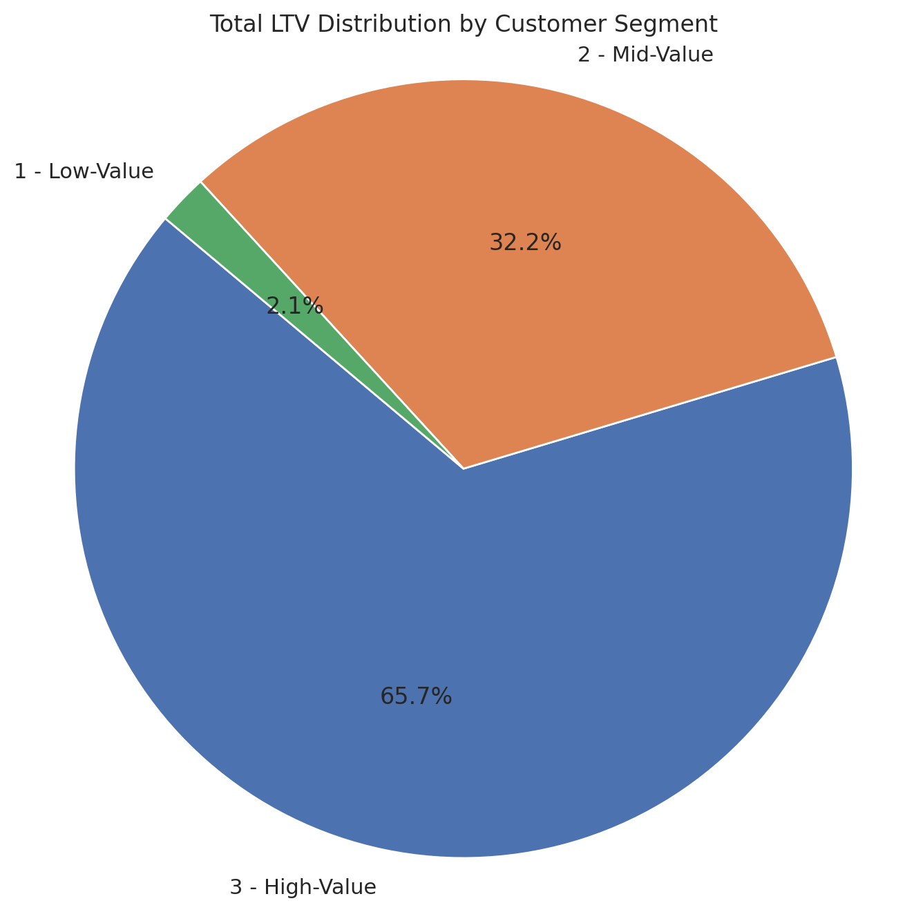
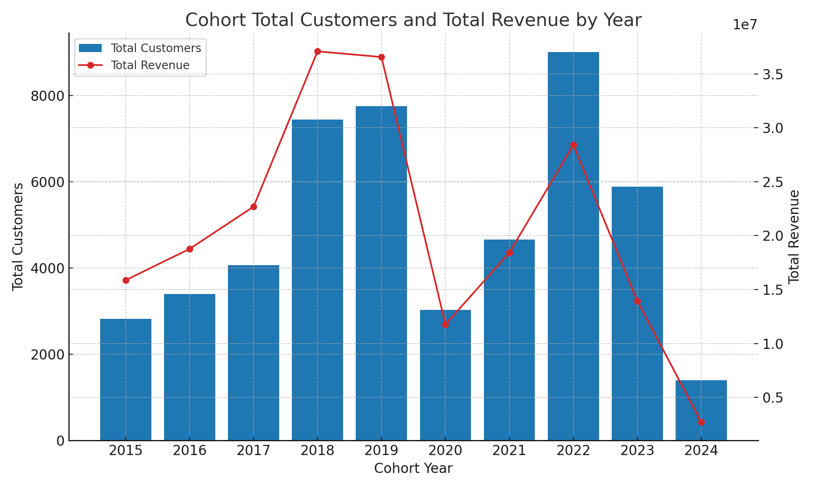
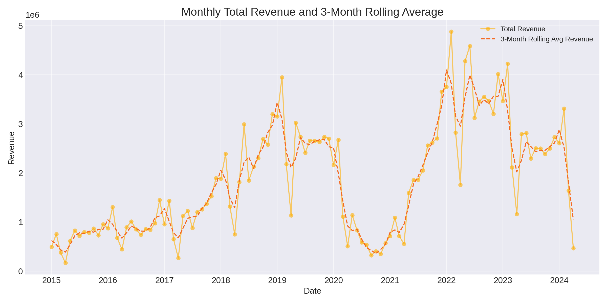
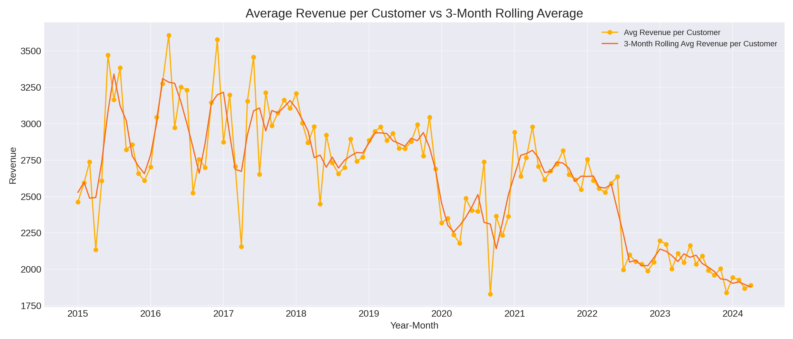
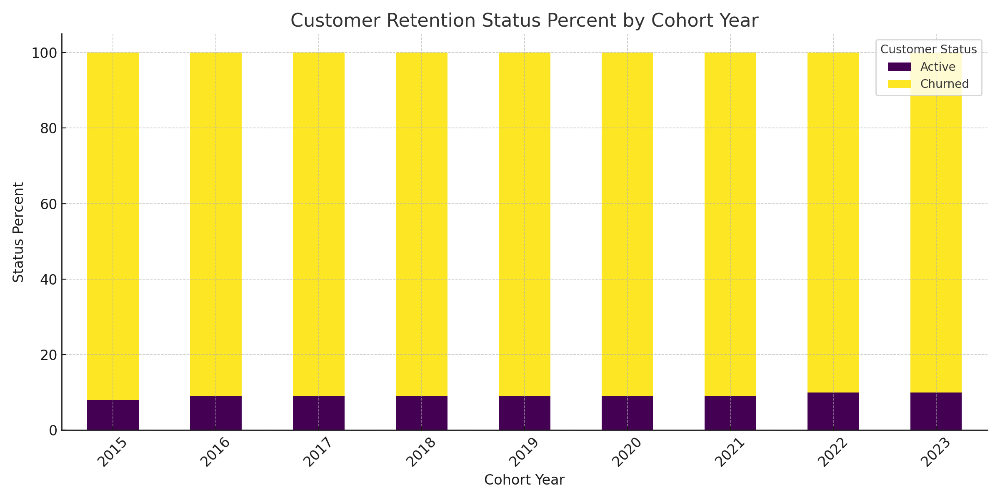

# Intermediate SQL - Sales Analysis

## Overview

This is an analysis of customer life time value, behavior and churn-rate for an e-commerce company. This project explores key business insights on how to improve customer retention and overall revenue.

## Business Questions

### 1. **Customer Segmentation**: Who are our most valuable customers?

---

### 2. **Cohort Analysis**: How do different customer groups generate revenue?

- #### 2.1 **Cohort Analysis Cont'd**: How do different customer groups' revenue change over time?

---

### 3. **Customer Retention**: Which customers have not purchased recently?

## Analysis Approach

### 1. **Customer Segmentation**

**Query**: [1_Customer_Segmentation.sql](1_Customer_Segmentation.sql)

```sql
SELECT
	customer_segment,
	SUM(total_ltv) AS total_ltv,
	COUNt(customerkey) AS customer_count,
	SUM(total_ltv) / COUNt(customerkey) AS avg_ltv
FROM segment_values
GROUP BY
	customer_segment
ORDER BY
	customer_segment DESC
```

- **Segmented customers** into High-, Mid-, and Low-Value tiers based on lifetime value (LTV).
- Calculated **total customers** and **aggregate LTV** per segment.
- Derived **average LTV** to assess per-customer value within each segment.

**Visualization**:  

<br>_Customer Count and Total Lifetime Value by Segment_

**Key Findings**:

- **High-Value segment** (12,372 customers) contributes the **highest total LTV** ($135.6M) and the **highest avg LTV** ($10.96K).
- **Mid-Value segment** is the **largest by count** (24,743) and drives significant total LTV (~$66.4M), with avg LTV of ~$2.68K.
- **Low-Value segment** (12,372 customers) shows minimal revenue impact (total LTV ~$4.3M, avg ~$347), indicating low immediate monetization.

**Business Insights**:

- **Prioritize High-Value customers**: Enhance loyalty and upsell programs to maximize revenue from this small but lucrative group.
- **Upsell opportunities in Mid-Value**: Target mid-value customers with tailored offers to elevate them to high-value status.
- **Optimize acquisition cost**: Consider reducing spend on low-value segments or shift tactics to increase their per-customer revenue (e.g., subscription models).

---

### 2. **Cohort Analysis**

#### **Query**: [2_Cohort_Analysis.sql](2_Cohort_Analysis.sql)

```sql
SELECT
	cohort_year,
	COUNT(DISTINCT customerkey) AS total_customers,
	SUM(total_net_revenue) AS total_revenue
FROM cohort_analysis
GROUP BY
	cohort_year
```

- Aggregated total customers and total revenue by cohort year.

- Assessed cohort size growth and revenue generation over time.

**Visualization**:  

<br>_Cohort Total Customers and Total Revenue by Year_

**Key Findings**:

- **Customer base growth until 2019–2022**: Cohorts grew from ~2.8K customers in 2015 to ~9K in 2022, reflecting successful acquisition efforts.
- **Revenue growth parallels customer growth**: Total revenue scaled from $15.9M in 2015 to $38M+ in 2018–2019 and peaked around $38M again in 2022.
- **Dip in 2020 due to external factors**: 2020 cohort saw a drop in both customer count (3.0K) and revenue ($13M), likely tied to pandemic impacts.
- **Recent slowdown**: 2024 (partial) cohort shows lower values, but may be incomplete year-to-date data.

**Business Insights**:

- **Sustain acquisition momentum**: Continue channels that drove growth up to 2022, while investigating any saturation signs.
- **Diversify acquisition strategies**: Post-2022 slowdown suggests exploring new markets or verticals to maintain growth.
- **Pandemic resilience planning**: Build flexible acquisition and retention plans to cushion against macro disruptions.

---

### 2.1. **Cohort Analysis Cont'd**

#### **Query**: [2_1_MonthlyRev_Customer_Trends.sql](2_1_Monthly_Rev_Customer_Trends.sql)

```sql
WITH cohort_year AS (
SELECT
	DATE_TRUNC('month', orderdate)::date AS year_month,
	SUM(total_net_revenue) AS total_revenue,
	COUNT(DISTINCT customerkey) AS total_customers,
	SUM(total_net_revenue) / COUNT(DISTINCT customerkey) AS avg_rev_customer
FROM cohort_analysis
GROUP BY year_month
ORDER BY year_month
)

SELECT
	year_month,
	total_revenue,
	avg_rev_customer,
	AVG(total_revenue) OVER (ORDER BY year_month ROWS BETWEEN 1 PRECEDING AND 1 FOLLOWING) AS roll_avg_3mo_total_rev,
	AVG(total_customers) OVER (ORDER BY year_month ROWS BETWEEN 1 PRECEDING AND 1 FOLLOWING) AS roll_avg_3mo_total_cus,
	AVG(avg_rev_customer) OVER (ORDER BY year_month ROWS BETWEEN 1 PRECEDING AND 1 FOLLOWING) AS roll_avg_3mo_rev_cus
FROM cohort_year
```

- Tracked average monthly revenue per customer over time
- Applied 3-month rolling averages for smoother trend analysis
- Segmented by cohort performance and temporal changes

#### **Visualization:**


<br> _Monthly Total Revenue and 3 Month Rolling Average_

<br> _Monthly Average Revenue Per Customer and 3 Month Rolling Average_

#### **Key Findings:**

- **Seasonal fluctuations are evident:** Peaks and troughs in the monthly revenue indicate strong seasonality, with higher revenues in certain periods.
- The average revenue per customer shows **notable month-to-month volatility**, highlighting seasonal or irregular purchasing behavior.
- The **3-month rolling average smooths short-term fluctuations**, revealing a general downward trend after initial peak months, suggesting a post-acquisition revenue drop.
- Some recovery is visible in recent months for newer cohorts, though not enough to offset the general decline.

#### **Business Insights:**

- **Capitalize on seasonal trends:** Identify high-performing periods to maximize marketing and sales efforts.
- Focus on **post-acquisition monetization strategies** (e.g., upselling or cross-selling) to sustain or boost average customer revenue after the first few months.
- **Focus on sustained growth initiatives:** Align investment in marketing or new product introductions during times when the rolling average shows promising upward momentum.
- Consider **subscription-based offerings or loyalty rewards** that encourage consistent purchasing to flatten volatility and raise overall average revenue.

---

### 3. **Customer Retention**

#### **Query**: [3_Customer_Retention.sql](3_Customer_Retention.sql)

```sql
SELECT
    cohort_year,
    customer_status,
    COUNT(customerkey) AS num_customers,
    SUM(COUNT(customerkey)) OVER(PARTITION BY cohort_year) AS total_customers,
    ROUND(100*COUNT(customerkey) / SUM(COUNT(customerkey)) OVER(PARTITION BY cohort_year)) AS status_percent
FROM churned_customers
GROUP BY
    cohort_year,
    customer_status
```

- Identified customer retention percentages by cohort year.
- Analyzed the proportion of active vs. churned customers over time.
- Calculated churn trends across multiple years for longitudinal insight.

#### **Visualization**:

<br> _Customer Churn by Cohort Year_

#### **Key Findings**:

- **Cohort churn stabilizes around 90%** after 2–3 years, indicating a predictable long-term drop-off pattern.
- **Retention rates remain consistently low (8–12%)**, pointing to systemic challenges in keeping customers long term.
- **Recent cohorts (2020–2022)** show marginally improved active rates, but the pattern suggests they may follow the same churn curve over time.

#### **Business Insights**:

- **Double down on early lifecycle retention**: Focus on the first 1–2 years using onboarding enhancements, loyalty incentives, and personalized communication.
- **Segmented win-back strategies**: Rather than broad campaigns, target high-value churned customers with specific offers or reactivation pathways.
- **Implement predictive churn modeling**: Use behavioral indicators and historical patterns to flag and engage at-risk customers _before_ they leave.

## Strategic Recommendations

### 1. **Prioritize Early Lifecycle Engagement**

- Implement a structured onboarding program with product education and personalized activation flows.
- Launch time-sensitive offers or tiered loyalty programs during the first 3–6 months to drive stickiness.
- Use marketing automation to nurture new customers with tailored content and re-engagement nudges.

---

### 2. **Maximize Value from High-LTV Segments**

- Deepen engagement with “High Value” customers via VIP perks, early access, or tailored services.
- Design targeted upsell and cross-sell campaigns for “Mid Value” segments with the potential to grow.
- Allocate more resources to retaining and expanding the share of high-LTV cohorts.

---

### 3. **Introduce Predictive Churn & Revenue Models**

- Develop a churn prediction model using usage, order frequency, and cohort age to flag at-risk customers.
- Pair churn insights with personalized win-back campaigns and dynamic discounts to recover value.
- Model customer lifetime value trends by cohort and acquisition source to prioritize channels with better long-term ROI.

---

### 4. **Diversify Customer Acquisition Strategy**

- Experiment with new acquisition channels or audience segments to find higher-retention sources.
- Invest in referral programs or partnerships to acquire customers with higher LTV potential.
- Use cohort-level profitability analysis to adjust CAC targets by channel.

---

### 5. **Consolidate Data for Executive Dashboards**

- Build a unified dashboard to track:
  - Retention rates by cohort
  - Rolling and average revenue per customer
  - Segment-wise LTV and volume
  - Churn prediction heatmaps
- Use these dashboards in quarterly reviews to realign marketing, CX, and growth priorities.

---

### **Summary Insight:**

Improving retention within the first 6–12 months, while focusing on the most valuable segments, will unlock more predictable growth and better ROI on acquisition.

## Technical Details

- **Database:** PostgreSQL
- **Analysis Tools:** PostgreSQL, DBeaver, VS Code
- **Visualization:** ChatGPT
